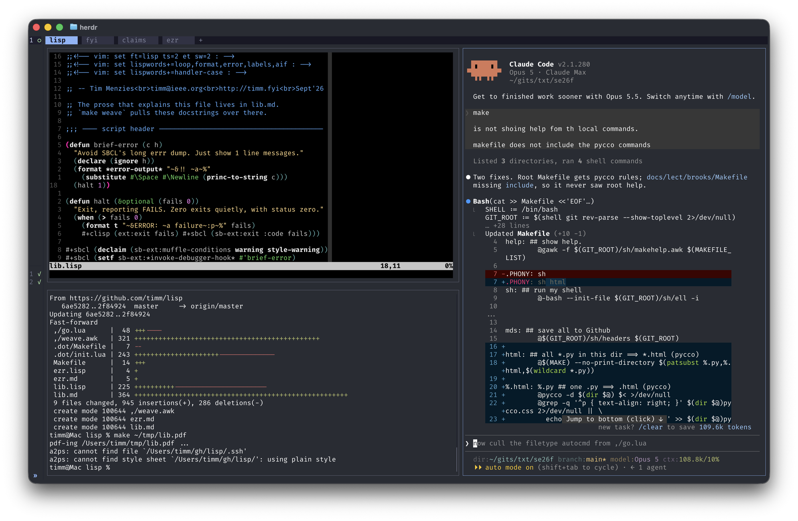

# lib.lisp

*Tim Menzies &middot; <timm@ieee.org> &middot; <http://timm.fyi> &middot; Sept'26*

Here is a file of useful LISP scripting tricks. It is the toolkit
underneath [`ezr.lisp`](ezr.lisp), which does active learning for
explainable multi-objective optimization. So you can read this as
a tutorial on either 
scripting or LISP or XAI (but note that  each is needed
to get to the next).

What follows is a journey through one small file, stopping
wherever there is something worth knowing. The code is real --
every fenced block below is pulled straight out of `lib.lisp` by
`make weave`, so all the code here is up to date with the
live version.

## Getting set up

<span class="tip installs">TIP 1</span>:  I use
SBCL to execute, rlwrap to debug, nvim to edit,
pandoc to document, gawk for the little bits of glue. Common
alternatives are CLISP (instead of SBCL), vscode (instead of
nvim), and any number of documentation and test tools. But
be aware that 
the doc/test tools here are
so simple (yet useful) that, for myself, I
cannot justify anything
more complex. 
Also, CLISP is much slower than SBCL; and I find that
vscode has
incomplete LISP support 


<span class="tip doco">TIP 2</span>: keep code 65 characters wide, max. That is what fits
a two-column listing in a technical paper, and it is the reason
nothing in this file has a long name. So all the code
here can be easily documented. 

<span class="tip scripting">TIP 3</span>: my whole workflow is what I call TUI21 -- two screens left and right where the right
hand side runs an AI (e.g. claude code) and the left 
splits vertically into editor (nvim)
and Unix-like command prompt (e.g. bash).



<span class="tip scripting">TIP 4</span>: TUI21 is an instance of a general principle. Do
things that port to many languages. There is always a next
language, and when you move to it the only things you carry are
the ones that were never language-specific in the first place --
your editor, your shell, your habit of shipping examples that
double as tests. Everything in this file is chosen that way.

## Making it run

<span class="tip scripting">TIP 5</span>: hash-bang scripts are clever enough to run
themselves. First mark the file executable, which on Linux and
Mac is just `chmod +x lib.lisp`. Then name the interpreter on
line one:

```txt
#!/usr/bin/env sbcl --script
```

After that, `./lib.lisp` works. One catch, and it cost me an
afternoon: `load` is not a shell, so it has no idea what `#!`
means and dies reading line 1. Any file that loads a hash-bang
script has to teach its reader to skip that line first, which is
what `ezr.lisp` does before it pulls in `lib.lisp`:

```lisp
(set-dispatch-macro-character #\# #\!
  (lambda (s c n) (declare (ignore c n)) (read-line s) (values)))
```

<span class="tip lisp">TIP 6</span>: SBCL is faster, but CLISP is what is already
installed at many sites, so I try to code for both. LISP makes
that cheap with conditional read-time forms -- watch for `#+sbcl`
and `#+clisp` below.

<span class="tip lisp">TIP 7</span>: the SBCL interactive command line is broken in a
small maddening way; you cannot up-arrow to your last command.
Fix it by never running it bare:

```txt
rlwrap sbcl
```

## Editing it

<span class="tip edit">TIP 8</span>: `nvim --clean` gives you a sane IDE -- bracket
matching, nothing else, no plugins to break. Add indent control
on the first lines of the file so the editor knows the dialect:

```txt
;;<!-- vim: set ft=lisp ts=2 et sw=2 : -->
;;<!-- vim: set lispwords+=loop,format,error,labels,aif : -->
```

`lispwords` is the one that matters. Without it, nvim lines the
body of a `loop` up under the word `loop`, which is right for a
function call and wrong for everything on that list.

## Documenting it

<span class="tip doco">TIP 9</span>: this file used to be documented by writing markdown
in comments and running `pycco -l scheme -d ~/tmp lib.lisp`. That
works, and for a single file it is hard to beat for effort spent.
But it has a ceiling: prose and code must interleave in one
stream, in one order, so a tutorial that wants to wander cannot.

So now the prose lives here, in `lib.md`, and the code stays in
`lib.lisp` with its docstrings. `make weave` pulls each form and
its docstring into this file. A line naming a form, or a fenced
block naming one, is a directive:

```txt
(defun shuffle
```

and weave replaces it with the docstring as prose and the code as
a fence. Rename a function without updating the prose and the
build fails, which is the entire point -- documentation that can
rot silently is worse than none.

<span class="tip doco">TIP 10</span>: keep docstrings in markdown, and end a line with
`e.g.` to turn the lines below it into an example block. That way
the same text reads well at the REPL and renders well on a page.

## The script header

<span class="tip lisp">TIP 11</span>: SBCL is very loud about crashes. Two lines calm it
down, and they must come after the handler they install:

```lisp
#+sbcl (declaim (sb-ext:muffle-conditions warning style-warning))
#+sbcl (setf sb-ext:*invoke-debugger-hook* #'brief-error)
```

Avoid SBCL's long errr dump. Just show 1 line messages.
```lisp
(defun brief-error (c h)
  (declare (ignore h))
  (format *error-output* "~&!! ~a~%"
    (substitute #\Space #\Newline (princ-to-string c)))
  (halt 1))
```

Exit, reporting FAILS. Zero exits quietly, with status zero.
```lisp
(defun halt (&optional (fails 0))
  (when (> fails 0)
    (format t "~&ERROR: ~a failure~:p~%" fails)
    #+clisp (ext:exit fails) #+sbcl (sb-ext:exit :code fails)))
```

## Macros

<span class="tip lisp">TIP 12</span>: write macros near the top of the file, so everything
below can use their expansions.

<span class="tip lisp">TIP 13</span>: use macros sparingly. They make code harder to read,
and the number that earn their keep is small. Here are the ones
that did.

Anaphoric if: THEN and ELSE read TEST's value as `it`; e.g.
```txt
(aif (parse thing) (print it))
```
```lisp
(defmacro aif (test then &optional else)
  `(let ((it ,test)) (if it ,then ,else)))
```

Dive through nested structs; e.g.
```txt
(? x a b) ==> (slot-value (slot-value x 'a) 'b)
```
```lisp
(defmacro ? (x k &rest ks)
  (if ks `(? (slot-value ,x ',k) ,@ks)
         `(slot-value ,x ',k)))
```

Dollar prefix reads a slot of the current struct, which must
be named `i`; e.g. `$x` ==> `(slot-value i 'x)`. Reader
macros have nowhere to hang a docstring, so this one is
documented in a comment.
```lisp
(set-macro-character #\$
  (lambda (s c) (declare (ignore c))
    `(slot-value i ',(read s t nil t))))
```

Count X in alist LST, starting the count at zero if new; e.g.
```txt
(let (seen)
  (mapc (lambda (x) (incf (has x seen))) '(a a b b b))
  seen) ==> ((b . 3) (a . 2))
```
```lisp
(defmacro has (x lst)
  `(cdr (or (assoc ,x ,lst :test #'equal)
            (car (setf ,lst (cons (cons ,x 0) ,lst))))))
```

The arrow macro is the one I reach for most. With it, that
counting example collapses to a single line.

A short lambda whose args arrive as %1 to %5; e.g.
```txt
(let (seen)
  (->> (incf (has %1 seen)) '(a a b b b))
  seen) ==> ((b . 3) (a . 2))
```
That is the `has` example above, now a one-liner.
```lisp
(defmacro -> (&body b)
  `(lambda (%1 &optional %2 %3 %4 %5)
     (declare (ignorable %2 %3 %4 %5))
     ,@b))
```

Mapcar BODY, as a short lambda, over LISTS.
```lisp
(defmacro ->> (body &rest lists)
  `(mapcar (-> ,body) ,@lists))
```

## Settings

<span class="tip scripting">TIP 14</span>: avoid magic numbers buried in the code. Anything
that steers behaviour belongs in one place the command line can
reach. Each setting is four things:

```txt
(name flag documentation default)
```

so a program's options are just a list:

```lisp
(defun defaults ()
  '((seed "-s" "random number seed"   1234567891)
    (p    "-p" "distance coeffecient" 2)))
```

Everything that tunes behaviour, as (name flag doc default).
```lisp
(defvar *settings* nil)
```

The current value of setting X, e.g. `(my seed)`.
```lisp
(defmacro my (x)
  `(fourth (assoc ',x *settings*)))
```

## Examples that are also tests

<span class="tip scripting">TIP 15</span>: ship demos that show the code off and shout when
it breaks. Here every demo is a function named `eg--` something,
and `cli` finds them by name, so `--rand` runs `eg--rand`. Each
starts from a fresh seed, and the process exit status is the
number that failed -- which means `make` and CI can read it
without parsing a word of output.

Update settings B4 from the command line, then halt.
`-s 42` sets one option and `--foo` runs `(eg--foo)`.
Exit status is the number of examples that failed.
```lisp
(defun cli (b4 &aux (av (cli-args)) (bad 0))
  (setf *settings* b4)
  (loop for flag = (pop av) while flag do
    (aif (find flag b4 :key #'second :test #'equal)
      (setf (fourth it) (thing (pop av)))
      (aif (cli-eg flag)
        (setf bad (cli-run it bad))
        (format t "?? ~a~%" flag))))
  (halt bad))
```

The strings after the program name on the command line.
```lisp
(defun cli-args ()
  #+sbcl  (cdr sb-ext:*posix-argv*)
  #+clisp ext:*args*)
```

The example function named by FLAG, if one is defined.
```lisp
(defun cli-eg (flag)
  (aif (intern (format nil "EG~:@(~a~)" flag))
    (and (fboundp it) it)))
```

Call F on a fresh seed, reporting any error it raises.
Returns FAILS, incremented if F blew up.
```lisp
(defun cli-run (f &optional (fails 0))
  (setf *seed* (my seed))
  (handler-case (progn (funcall f) fails)
    (error (e)
      (format t "~&!! ~(~a~): ~a~%" f
        (substitute #\Space #\Newline (princ-to-string e)))
      (1+ fails))))
```

Coerce STR to a number, a boolean, `?`, or leave it alone.
```lisp
(defun thing (str &aux (*read-eval* nil))
  (let ((v (handler-case (read-from-string str nil :none)
             (error () :none))))
    (if (or (numberp v) (member v '(t nil ?))) v str)))
```

## Random numbers

<span class="tip lisp">TIP 16</span>: if you want reproducible runs you cannot use the
built-in generator, because its stream differs across
implementations. A dozen lines buys you the same numbers
everywhere, forever.

State of the random number generator.
```lisp
(defvar *seed* 1234567891)
```

A random float in [0,N), from our own generator.
Rolling our own keeps the stream identical across platforms.
```lisp
(defun rand (&optional (n 1))
  (setf *seed* (mod (* 16807 *seed*) 2147483647))
  (* n (- 1.0d0 (/ *seed* 2147483647.0d0))))
```

A random integer in [0,N).
```lisp
(defun rint (&optional (n 100))
  (floor (* n (rand))))
```

A new list holding LST's items in random order.
Copies to a vector first, for fast random access.
```lisp
(defun shuffle (lst &aux (v (coerce lst 'vector)))
  (loop for i from (1- (length v)) downto 1 do
    (rotatef (aref v i) (aref v (rint (1+ i)))))
  (coerce v 'list))
```

## Odds and ends

Print KVS as key/value pairs, one pair per line.
```lisp
(defun kv (&rest kvs)
  (loop for (k v) on kvs by #'cddr do
    (format t "~&~(~a~)~10t~s~%" k v)))
```

The rows of FILE, each one a list of coerced cells.
```lisp
(defun csv (file)
  (with-open-file (s file)
    (loop for line = (read-line s nil) while line
      collect (csv-cells (string-right-trim '(#\Return) line)))))
```

Split S on SEP, coercing each cell with `thing`.
```lisp
(defun csv-cells (s &optional (sep #\,) (lo 0)
                  (hi (position sep s :start lo)))
  (cons (thing (subseq s lo hi))
        (if hi (csv-cells s sep (1+ hi)))))
```
